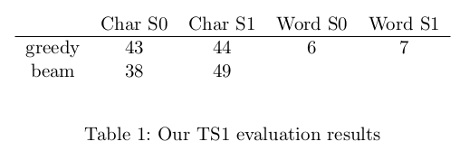
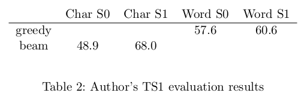

# NPNLG Team Project

## Table of Contents
* [General info](#general-info)
* [Team members](#team-members)
* [Documentation](#documentation)
* [Project Outcome](#project-outcome)
* [Other Reference](#other-reference)

## General Info
This project aims to reproduce the key results of the paper "Cohn-Gordon et al. (2018), Pragmatically Informative Image Captioning with Character-Level Inference" and critically access its evaluation approaches with beam search and greedy sampling for the character- and word-level incremental predictions.   
It is part of the course work for the 6-ECTS course "Universität Tübingen, WS2022/2023, Prof Dr Michael Franke, Neural Pragmatic Natural Language Generation"

## Team Members
- [Fanyi Meng](https://github.com/Meng3www)
- [Jia Sheng](https://github.com/jiasheng1100)

## Documentation
General:
- [report/report.pdf](https://github.com/Meng3www/PPlusPlus/blob/main/report/report.pdf): project report
- [logFile.md](https://github.com/Meng3www/PPlusPlus/blob/main/logFile.md): project timeline and progress

Model Training:
- original files by the author modified to run word models on [word_model_branch](https://github.com/Meng3www/PPlusPlus/tree/word_model_branch) after the Great Schism: 
    - [bayesian_agents/](https://github.com/Meng3www/PPlusPlus/tree/word_model_branch/bayesian_agents)
    - [recursion_schemes.py](https://github.com/Meng3www/PPlusPlus/blob/word_model_branch/recursion_schemes/recursion_schemes.py) for greedy search
    - [Model.py](https://github.com/Meng3www/PPlusPlus/blob/word_model_branch/train/Model.py)
    - some files in [utils/](https://github.com/Meng3www/PPlusPlus/tree/word_model_branch/utils)
- [coco_data/](https://github.com/Meng3www/PPlusPlus/tree/word_model_branch/coco_data): 
    - Preprocess_coco for pre-processing coco images and captions into training data (feature - caption tensors in pairs) and testing data (with target captions and url for the image) in `.py` and `.ipynb`, to be used on urobe and Google Colab respectively
    - coco_word_model(_desclr): train coco model (with descending learning rate)
- [vg_data/](https://github.com/Meng3www/PPlusPlus/tree/word_model_branch/vg_data):
    - [Preprocess_vg.ipynb](https://github.com/Meng3www/PPlusPlus/blob/word_model_branch/vg_data/Preprocess_vg.ipynb) vg data processed on Google Colab
    - [vg_word_model(_urobe)] train vg model, learning rate changed manually
- RNN models trained: [coco_word_decoder.pk](https://github.com/Meng3www/PPlusPlus/blob/word_model_branch/data/models/coco_word_decoder.pkl) and [vg_word_decoder.pkl](https://github.com/Meng3www/PPlusPlus/blob/word_model_branch/data/models/vg_word_decoder.pkl) 
- training-testing data cannot be uploaded due to LFS quota running out 

Evaluation:
- [evaluate/build_test_data.py](https://github.com/Meng3www/PPlusPlus/blob/main/evaluate/build_test_data.py): build Test set 1 data
- [vg_data/ts1_img/](https://github.com/Meng3www/PPlusPlus/tree/main/vg_data/ts1_img): TS1 data
- [evaluate/generate_captions.py](https://github.com/Meng3www/PPlusPlus/blob/main/evaluate/generate_captions.py) & [evaluate/generate_captions_word.py](https://github.com/Meng3www/PPlusPlus/blob/main/evaluate/generate_captions_word.py): generate captions of TS1 data with char-level and word-level models
- [evaluate/ts1_captions](https://github.com/Meng3www/PPlusPlus/blob/main/evaluate/ts1_captions) & [evaluate/ts1_captions_word](https://github.com/Meng3www/PPlusPlus/blob/main/evaluate/ts1_captions_word): char- and word-level model-generated captions of TS1 data
- [evaluate/get_accuracy_ts1.py](https://github.com/Meng3www/PPlusPlus/blob/main/evaluate/get_accuracy_ts1.py) & [evaluate/get_accuracy_ts1_word.py](https://github.com/Meng3www/PPlusPlus/blob/main/evaluate/get_accuracy_ts1_word.py): run automatic evalution to obtain accuracy scores
- [evaluate/get_accuracy_ts1_output.txt](https://github.com/Meng3www/PPlusPlus/blob/main/evaluate/get_accuracy_ts1_output.txt) & [evaluate/get_accuracy_ts1_word_output.txt](https://github.com/Meng3www/PPlusPlus/blob/main/evaluate/get_accuracy_ts1_word_output.txt): detailed output of evaluation
- [evaluate/ts1_accuracy](https://github.com/Meng3www/PPlusPlus/blob/main/evaluate/ts1_accuracy) & [evaluate/ts1_accuracy_word](https://github.com/Meng3www/PPlusPlus/blob/main/evaluate/ts1_accuracy_word): accuracy scores	

## Project Outcome
Our results:

Results from the original paper:

For more details, please refer to our [project report](https://github.com/Meng3www/PPlusPlus/blob/main/report/report.pdf).

## Other Reference
- Course homepage: https://michael-franke.github.io/npNLG/
- Gohn-Gordon et al. (2918): https://aclanthology.org/N18-2070/

Lastly modified on 28 May 2023\
Tübingen

